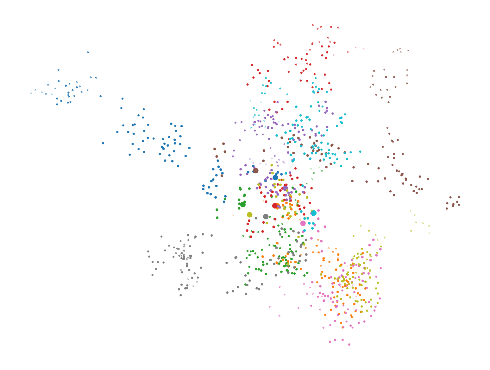
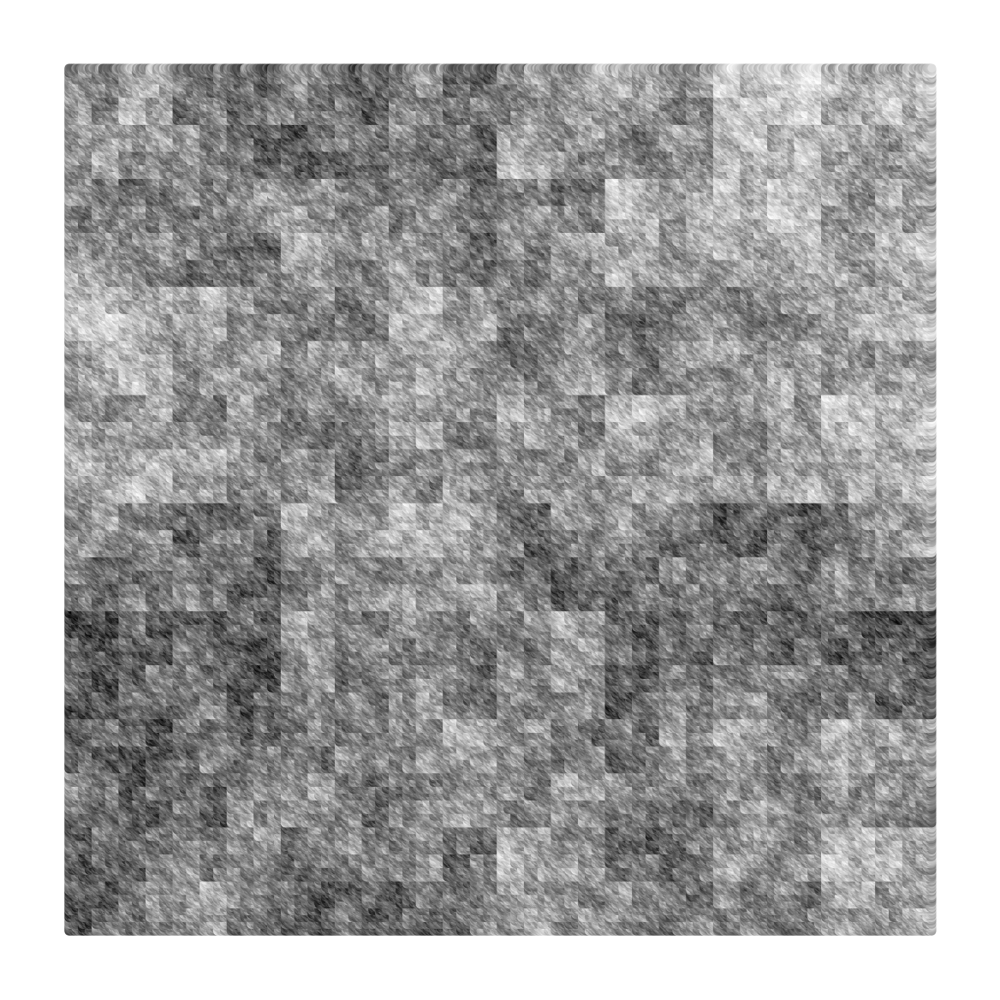

# FractalUniverses

Simple scripts to generate pictures of hierarchical fractal and multifractal universes.

[Soneira-Peebles model](https://www.astro.rug.nl/~weygaert/tim1publication/lss2007/soneirapeebles.pdf)

[Rayleigh-Levy model](https://www.wikiwand.com/en/L%C3%A9vy_flight)

[Multiplicative random process](https://adsabs.harvard.edu/full/1990ApJ...357...50M)

